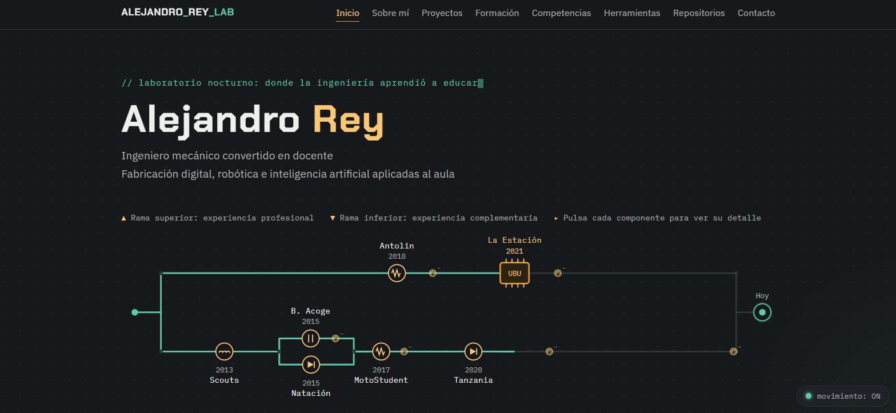

# Laboratorio Nocturno — Portfolio de Alejandro Rey Lab

Portfolio profesional de **Alejandro Rey**, docente, formador de formadores y gestor de proyectos educativos en La Estación de la Ciencia y la Tecnología (Universidad de Burgos).

🔗 **Web en vivo:** https://alejandroreylab.github.io/portfolio/



## Qué es este proyecto

Este repositorio contiene el código fuente de mi portfolio personal: una web estática que funciona como escaparate profesional (para centros educativos, formación y colaboraciones) y como repositorio vivo de conocimiento, donde voy documentando proyectos, herramientas y recursos a medida que los desarrollo.

## Tecnologías utilizadas

- **HTML5 / CSS3 / JavaScript** vanilla, sin frameworks ni dependencias externas
- Alojado gratuitamente en **GitHub Pages**
- Diseño responsive, con animaciones que respetan `prefers-reduced-motion`

## Estructura del proyecto

```
├── index.html              # Portada, con "El Circuito del Tiempo" (línea temporal interactiva)
├── sobre-mi.html            # Trayectoria y presentación
├── proyectos.html           # Portfolio de proyectos educativos
├── formacion.html           # Formación académica y complementaria
├── competencias.html        # Competencias técnicas y transferibles
├── herramientas.html        # Herramientas que utilizo habitualmente
├── repositorios.html        # Repositorios externos curados por temática
├── contacto.html            # Vías de contacto
├── como-actualizar.html     # Guía de mantenimiento de la propia web
├── css/
│   └── estilos.css
└── js/
    ├── global.js
    └── circuito.js
```

## Cómo actualizar esta web

El propio sitio incluye una guía de mantenimiento en [`como-actualizar.html`]([como-actualizar.html](https://alejandroreylab.github.io/portfolio/como-se-hizo.html)) [`como-actualizar.html`], pensada para poder añadir nuevos proyectos, herramientas o entradas sin necesidad de rediseñar nada.

## Licencia

Este proyecto distingue entre el **código fuente** y el **contenido personal**:

- **Código (HTML, CSS y JavaScript):** publicado bajo licencia **MIT** (ver [`LICENSE`](LICENSE)). Puedes reutilizar, adaptar o partir de esta estructura para tu propio portfolio, citando la autoría original.
- **Contenido (textos, currículum, biografía, descripciones de proyectos, fotografías e imágenes):** **todos los derechos reservados**. Este contenido es personal y no está autorizado su copia, reutilización, redistribución ni publicación en otros sitios, total o parcialmente, sin permiso expreso por escrito.

## Autoría y contacto

**Alejandro Rey**
📧 alejandroreylab@gmail.com

Si tienes dudas sobre la reutilización del código o quieres contactar por temas profesionales (formación, colaboraciones, proyectos), escríbeme directamente.
